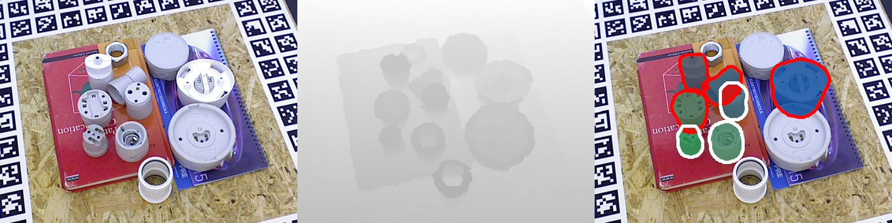
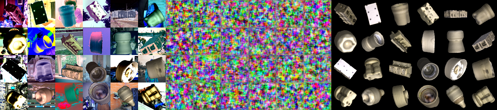

# Detection and pose estimation of unseen objects

This repository contains the source codes and instructions for the project Detection and pose estimation of unseen objects.

## Unseen Object Amodal Instance Segmentation (UOAIS)
Note: The following section contains the setup instructions as described in [1] for a local installation.  The setup instructions for google colab are found in the next section.

### Environment setup (local)

1. Download source codes and checkpoints
```
git clone https://github.com/gist-ailab/uoais.git
cd uoais
mkdir output
```
2. Download checkpoints at [GDrive](https://drive.google.com/drive/folders/1D5hHFDtgd5RnX__55MmpfOAM83qdGYf0?usp=sharing) 

3. Move the `R50_depth_mlc_occatmask_hom_concat` and `R50_rgbdconcat_mlc_occatmask_hom_concat` to the `output` folder.

4. Move the `rgbd_fg.pth` to the `foreground_segmentation` folder


5. Set up a python environment
```
conda create -n uoais python=3.8
conda activate uoais
pip install torch torchvision 
pip install shapely torchfile opencv-python pyfastnoisesimd rapidfuzz termcolor
```
6. Install [detectron2](https://detectron2.readthedocs.io/en/latest/tutorials/install.html)

7. Build custom [AdelaiDet](https://github.com/aim-uofa/AdelaiDet)
```
python setup.py build develop
```
### Environment setup (Google Colab)
In case of updates please refer to the compatibility list of Tensorflow, Python, CUDA, and cuDNN [here](https://www.tensorflow.org/install/source#gpu) and update the sections accordingly.
```
!pip uninstall --yes torch torchvision torchaudio torchtext
!pip install torch==1.8.1+cu102 torchvision==0.9.1+cu102 torchaudio==0.8.1 -f https://download.pytorch.org/whl/torch_stable.html
!pip install shapely torchfile opencv-python pyfastnoisesimd rapidfuzz termcolor
```
Installing detectron2:
```
!git clone https://github.com/facebookresearch/detectron2.git
!python -m pip install -e detectron2
!rm -rf build/ **/*.so
!python -m pip install 'git+https://github.com/facebookresearch/detectron2.git@5aeb252b194b93dc2879b4ac34bc51a31b5aee13'
```
Installing  AdelaiDet:
```
!git clone https://github.com/aim-uofa/AdelaiDet.git
%cd AdelaiDet
!python setup.py build develop
%cd /content/uoais
!python setup.py build develop
```
### Prepare datasets
### Dataset Preparation

1.  Download `UOAIS-Sim.zip` and `OSD-Amodal-annotations.zip` at [GDrive](https://drive.google.com/drive/folders/1D5hHFDtgd5RnX__55MmpfOAM83qdGYf0?usp=sharing)
2.  Download `OSD-0.2-depth.zip` at [OSD](https://www.acin.tuwien.ac.at/vision-for-robotics/software-tools/osd/). [2]
4.  Extract the downloaded datasets and organize the folders as follows

```
uoais
├── output
└── datasets
       ├── OSD-0.20-depth # for evaluation on tabletop scenes
       │     └──amodal_annotation # OSD-amodal
       │     └──annotation
       │     └──disparity
       │     └──image_color
       │     └──occlusion_annotation # OSD-amodal
       └── UOAIS-Sim # for training
              └──annotations
              └──train
              └──val

```

### Verify working setup by running on sample OSD dataset
```
# UOAIS-Net (RGB-D) + CG-Net (foreground segmentation)
python tools/run_on_OSD.py --use-cgnet --dataset-path ./sample_data --config-file configs/R50_rgbdconcat_mlc_occatmask_hom_concat.yaml
# UOAIS-Net (depth) + CG-Net (foreground segmentation)
python tools/run_on_OSD.py --use-cgnet --dataset-path ./sample_data  --config-file configs/R50_depth_mlc_occatmask_hom_concat.yaml
# UOAIS-Net (RGB-D)
python tools/run_on_OSD.py --dataset-path ./sample_data --config-file configs/R50_rgbdconcat_mlc_occatmask_hom_concat.yaml
# UOAIS-Net (depth)
python tools/run_on_OSD.py --dataset-path ./sample_data --config-file configs/R50_depth_mlc_occatmask_hom_concat.yaml
```

## Training UOAIS-Net

### Dataset
The BOP T-Less dataset can be obtained from [here](https://bop.felk.cvut.cz/datasets/)
```
!export SRC=https://bop.felk.cvut.cz/media/data/bop_datasets
!wget --no-check-certificate "https://bop.felk.cvut.cz/media/data/bop_datasets/tless_train_pbr.zip"  # PBR training images (rendered with BlenderProc4BOP).
!unzip tless_train_pbr.zip -d tless
```
Generate occlusions masks
```
python scripts/toOccludedMask.py
```
Restructure files to the UOAIS-SIM format
```
python scripts/moveFull.py
```
Generate appropriate annotations for UOAIS with:
```
python scripts/generate_uoais_annotation.py
```

### Training
Train UOAIS-Net with the new dataset (RGB-D) and config:

Replace config file in "uoais/configs/R50_rgbdconcat_mlc_occatmask_hom_concat.yaml" with the updated file from /configs
```
python train_net.py --config-file configs/R50_rgbdconcat_mlc_occatmask_hom_concat.yaml
```
### Visualisation
Insert an arbitrary scene in: `/sample_data`
```
python tools/run_on_Tless.py --use-cgnet --dataset-path ./sample_data --config-file configs/R50_rgbdconcat_mlc_occatmask_hom_concat.yaml
```
Sample output:

## 6D Pose estimation
### Datasets
This project used the BOP T-Less dataset which can be obtained from [here](https://bop.felk.cvut.cz/datasets/). However, other BOP datasets are compatible as well.

The `models` folder contains investigated subgroup of element. The `CAD models` contains the bas SOLIDWORKS parts as well as the respective .PLY files. 

Note: Do not use ASCII encoding.

Any file variation with regard to the reference frame can be generated manually in Blender or in case of renders be generated with [BlenderProc](https://github.com/DLR-RM/BlenderProc).

### Detected masks
Object detection and segmentation output based on [MaskRCNN](https://github.com/facebookresearch/maskrcnn-benchmark). [3]
The required COCO annotations of the dataset can be converted with the [BOP toolkit](https://github.com/thodan/bop_toolkit). The used COCO images can be downloaded from [here](https://cocodataset.org/#download).

The detection sample output for both the full and reduced BOP T-Less test set masks are provided in `MASKS`.

The following provided script can be used the re-annotate existing segmentations to an arbitrary object subset. In case of varying reference frame for objects which are to be approximated by other / general objects this script is to be embedded in the evaluation section. By setting `makeGTruth=True` ground truth masks can be created.
```
python reAnnotate.py
```

### Environment set-up (local)
The following content is based on [2]. 

Requirements:
```
sudo apt-get install libglfw3-dev libglfw3
sudo apt-get install libassimp-dev
pip install --user --pre --upgrade PyOpenGL PyOpenGL_accelerate
pip install --user cython
pip install --user cyglfw3
pip install --user pyassimp==3.3
pip install --user imgaug
pip install --user progressbar
```
Detailed instructions can be found [here](https://github.com/DLR-RM/AugmentedAutoencoder/tree/multipath). 
### Environment set-up (Google Colab)
```
!pip install tensorflow==2.6.0
!pip install opencv-python
!pip install --user --pre --upgrade PyOpenGL PyOpenGL_accelerate
!pip install --user cython
!pip install --user cyglfw3
!pip install --user pyassimp==3.3
!pip install --user imgaug
!pip install --user progressbar
%env PYOPENGL_PLATFORM='egl' #include if headless rendering is desired - currently limited colab support
!pip install ez_setup
!pip install unroll
!easy_install -U setuptools
#clone https://github.com/DLR-RM/AugmentedAutoencoder.git
!pip install --user .
!export AE_WORKSPACE_PATH=/path/to/autoencoder_ws
!mkdir $AE_WORKSPACE_PATH
!cd $AE_WORKSPACE_PATH
!ae_init_workspace
```
### Multi-path encoder training
1. Insert the 3D models
2. Insert background images e.g. PascalVOC
3. Replace config in `$AE_WORKSPACE_PATH/cfg/exp_group/my_mpencoder.cfg` with `configs/my_mpencoder.cfg` and modify if training setup differs.
4. Update paths of 3D models and background images if applicable in config file. 
5. Start training with `ae_train exp_group/my_mpencoder`

The generated training images can be viewed from the directory `$AE_WORKSPACE_PATH/experiments/exp_group/my_mpencoder/train_figures`

A sample training image, where the middle part of the image visualises the reconstruction:


The embeddings / codebooks are created with:
```
ae_embed_multi exp_group/my_mpencoder --model_path '.ply file path'
```

### Evaluation
The [BOP Toolkit](https://github.com/thodan/bop_toolkit) is required.

Move the trained encoder to `$AE_WORKSPACE_PATH/experiments/exp_group/NAMEOFExp_Group`

Replace the config file in  `auto_pose/ae/cfg_m3vision/m3_config_lmo_mp.cfg` with `configs/m3_config_tless.cfg`.

Run the evaluation with:
```
python auto_pose/m3_interface/compute_bop_results_m3.py auto_pose/ae/cfg_m3vision/m3_config_lmo_mp.cfg 
                                                     --eval_name test 
                                                     --dataset_name=lmo 
                                                     --datasets_path=/path/to/bop/datasets 
                                                     --result_folder /folder/to/results 
                                                     -vis
```

## References

[1] S. Back _et al._, “Unseen Object Amodal Instance Segmentation via Hierarchical Occlusion Modeling,” in _2022 International Conference on Robotics and Automation (ICRA)_, May 2022, pp. 5085–5092. doi: 10.1109/ICRA46639.2022.9811646.

[2] M. Sundermeyer _et al._, “Multi-path Learning for Object Pose Estimation Across Domains,” Aug. 2019, doi: 10.48550/arXiv.1908.00151.

[3] K. He, G. Gkioxari, P. Dollár, and R. Girshick, “Mask R-CNN,” Mar. 2017, doi: 10.48550/arXiv.1703.06870.
